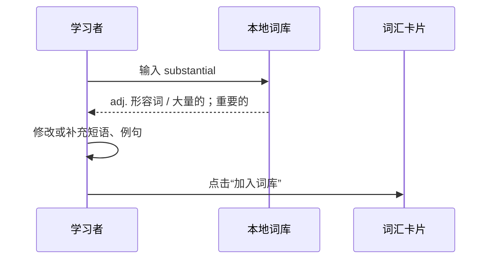
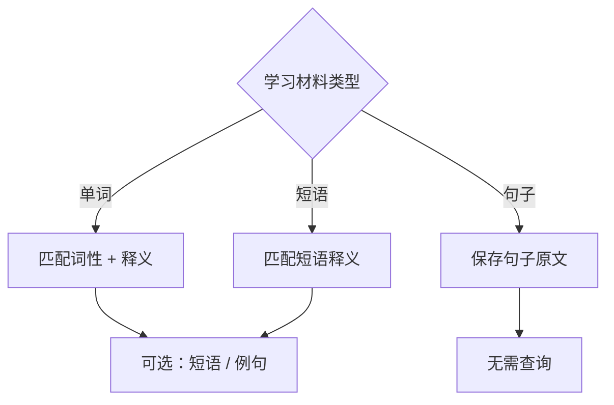
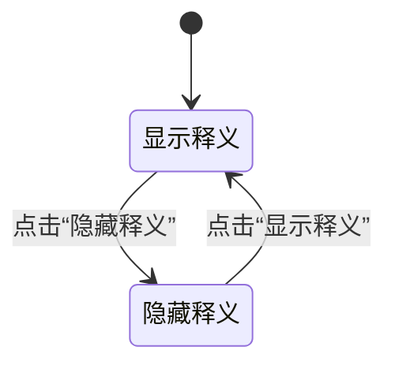
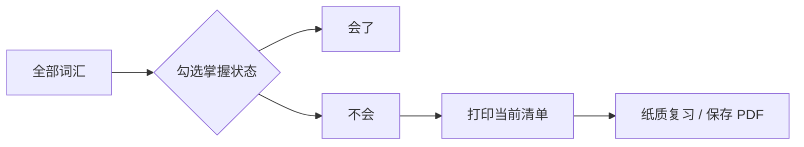

# IELTS Vocabulary Bench｜本地的雅思单词本

<p align="center">
  
</p>

这是一个面向中文学习者的本地雅思词汇本：把不会的单词、短语和句子放进来，随时标记掌握状态，并打印成通勤复习清单。

一个无需安装、无需后端的 IELTS 词汇记录与打印工具。

它适合在电脑上整理不会的单词，也适合在地铁、公交或排队时打印成纸质清单复习。所有学习记录默认保存在当前浏览器的 `localStorage` 中，不需要注册账号。

## 功能概览

- 记录单词、词性、中文释义、多个常用短语和例句。
- 输入英文单词后，优先从内置离线词库自动匹配词性和中文释义。
- 内置约 8800 个词条：包括 Excel 词库提取内容、GitHub IELTS Word List 内容以及手工补充词。
- 离线词库优先，查询不依赖网络，适合网络不稳定的环境。
- 离线词库没有命中时，尝试访问公开英文词典接口；请求最多等待 4 秒。
- 勾选单词标记为“已掌握”，统计区会同步显示总词汇、待背数量、已掌握数量和进度。
- 按“全部 / 不会 / 会了”筛选，也可以按单词或中文释义搜索。
- 打印时自动隐藏录入区、搜索区和操作按钮，并隐藏已掌握单词，生成适合纸质复习的待背清单。
- 支持删除不再需要的词条。

## 快速开始

### 直接打开

双击 `index.html`，或在 macOS 终端运行：

```bash
open index.html
```

不需要 `npm install`，也不需要启动服务器。

### 添加单词

1. 在“记下一颗新词”输入框中输入英文单词。
2. 离开输入框后，工具会先从本地词库匹配词性和释义。
3. 词性和释义可以直接修改。
4. 短语是可选项，每行填写一个短语；没有短语可以留空。
5. 例句是可选项，没有例句可以留空。
6. 点击“加入词库”。

## 打印复习清单

1. 点击“不会”筛选，只保留待背单词。
2. 点击右侧“打印当前清单”。
3. 在系统打印窗口中选择打印机，或选择“存储为 PDF”。

打印样式会自动隐藏编辑控件，并将内容调整为黑白纸张友好的布局。

## 数据与隐私

- 你的新增单词和掌握状态保存在浏览器本地，不会自动上传到本项目。
- 浏览器清除站点数据、使用隐私窗口或更换浏览器后，本地记录可能不可见。
- 内置词库文件是静态 JavaScript 数据，不会修改你的学习记录。
- 对内置词库未命中的单词，工具会尝试请求 `dictionaryapi.dev`。网络不可用时会在 4 秒后停止等待，你仍然可以手动填写并保存。

## 项目结构

```text
index.html                  页面结构
styles.css                  页面样式、响应式布局、打印样式
app.js                      交互逻辑、本地保存、筛选、打印和查询
ielts-dictionary.js         从本地 Excel 提取的离线词库
repo-ielts-dictionary.js    从 GitHub IELTS Word List 提取的离线词库
notes.md                    需求与数据来源记录
task_plan.md                实现计划与验证记录
```

## 词库来源

当前内置数据来自以下两个本地来源：

1. **雅思王听力语料库（剑19版）**：本地的《语料库练习模板(剑19)-2025.7.6.xlsx》整理文件
2. [`fanhongtao/IELTS`](https://github.com/fanhongtao/IELTS) 中的 `IELTS Word List.txt`

词库内容仅用于个人学习整理。原始资料的版权和准确性以其来源方为准；本项目不对词义、词性或完整性作考试保证。

## 技术说明

- 纯 HTML、CSS 和原生 JavaScript。
- 不依赖构建工具和第三方前端框架。
- 数据通过 `localStorage` 持久化。
- 词条查询顺序：本地缓存 → 内置离线词库 → 公开英文词典接口。
- `app.js` 和 `repo-ielts-dictionary.js` 已通过 Node.js 语法检查。

## 当前限制

- 不同来源的词条格式不完全一致，部分导入词条的词性会显示为“IELTS 词汇”，可以在录入后手动修正。
- 部分词条只有单词和中文释义，没有短语或例句，这是源数据本身缺少对应内容。
- 本工具目前是单机本地版，不提供跨设备同步和账号登录。

## License

本项目代码按个人学习用途提供。词库内容的权利归原始资料及其作者所有，请遵守原始仓库和资料的许可、署名及使用条件。

## 图文使用说明

### 1. 认识主界面

下图是词汇本的完整工作区。左侧负责录入，右侧负责浏览、筛选和复习；顶部统计区显示当前进度。

<p align="center">
  
</p>


### 2. 添加单词

在左侧表单中输入英文单词。离开输入框后，工具会优先查询本地词库；匹配成功后，词性和中文释义会立即填入。自动填入的内容仍然可以修改。

| 区域 | 用途 | 是否必填 |
| --- | --- | --- |
| 单词 | 需要记忆的英文词 | 必填 |
| 词性 | 例如 `n. 名词`、`v. 动词` | 可修改 |
| 释义 | 中文解释，可补充多个义项 | 可修改 |
| 常用短语 | 每行填写一个搭配 | 可选 |
| 例句 | 帮助记忆的完整句子 | 可选 |



### 3. 添加短语与句子

短语和句子不必依附于某个单词。可以把它们作为独立的学习条目保存：

- 短语：输入短语后，同样尝试自动匹配中文释义；一个短语可以有多个搭配，写在“常用短语”框中，每行一个。
- 句子：只保存句子本身，不需要自动匹配词性或释义；适合记录听力原句、写作模板和自己的例句。



### 4. 隐藏释义进行自测

词汇列表右上角的“隐藏释义”按钮会一次隐藏所有卡片的词性和中文释义，只留下英文内容。再次点击“显示释义”即可恢复。这个模式适合先回忆，再核对答案。



### 5. 勾选、筛选与打印

每张卡片左侧的复选框用于标记掌握状态。标记后，顶部进度会立即更新；点击“不会”只显示待背词，再点击“打印当前清单”即可生成纸质复习页。



打印版会自动隐藏录入面板、搜索框、按钮和已掌握词条，只保留待背内容。建议在打印前先切换到“不会”标签，减少纸张页数。

### 6. 数据保存与恢复

新增词条和勾选状态保存在当前浏览器的 `localStorage` 中。关闭页面后再次打开仍会保留；清除浏览器站点数据、使用隐私窗口或更换浏览器时，记录可能不可见。内置词库文件本身不会被修改。
