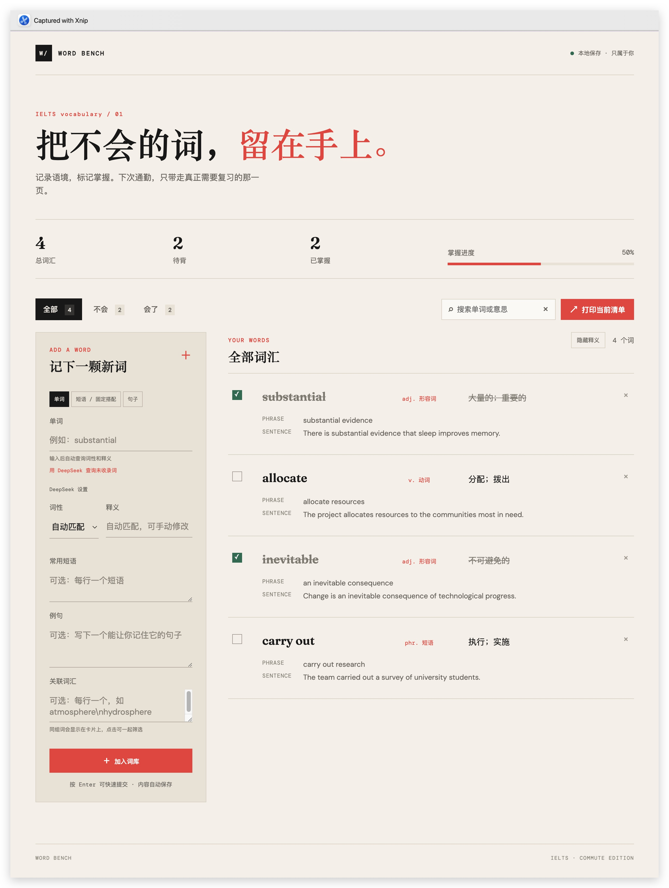

# 为了背刘洪波的《雅思词汇真经》，我用 Codex 手搓了一个背单词 App

一个面向中文学习者的本地雅思词汇 Web App：记录不会的单词、短语、固定搭配和句子，自动补全词性与释义，按主题归类，建立关联词组，勾选掌握状态，并打印成通勤复习清单。

为了背刘洪波的《雅思词汇真经》，我用 Codex 手搓了一个背单词 App。

我有很多通勤时间和碎片🧩时间，但一拿起手机就很容易走神、分心，难以持续专注。手机背单词经常变成刷别的东西，所以我更适合用电脑整理，再带着纸质清单出门复习。

问题是：纸质书太重，自己整理又很懒。遇到不会的词，我只想快速扔进去，之后自动归纳，而不是重新做一套笔记系统。

这个单词本就是为这个场景做的：

- 输入单词后，自动匹配词性和中文释义。
- 接入刘洪波《雅思词汇真经》章节词库，以及多个 IELTS 词汇来源，实现词汇、词性、释义和主题的本地自动映射。
- 按自然地理、植物研究、动物保护、太空探索、学校教育等雅思主题归类，减少手动整理。
- 常用短语、短语释义和例句可以一起记录。
- 可以单独添加短语、固定搭配和句子。
- 关联词可以自动生成单词卡，一组一起背。
- 接入 DeepSeek API，词库没有收录的词可以自动补全词性、释义、短语、短语释义和例句。
- 不会的词直接打勾标记，已掌握和待背内容分开看。
- 支持导出和导入，换电脑也能迁移。
- 支持打印当前待背清单，通勤时不用一直看手机。
- 桌面端左右面板等高：左侧负责录入，右侧词汇列表独立滚动，录入区始终保持可用。
- 还接入了 DeepSeek，词库里没有的词可以自动补充释义、短语和例句。

我的使用方式是：电脑上快速录入和整理，出门前打印一页，只带真正不会的词，在地铁上利用碎片时间复习。

这是一个本地运行的小工具，不追求复杂打卡和社交功能，只解决一个具体问题：把不会的词留下来，整理好，再带走复习。

GitHub：<https://github.com/anonymousguestme-ctrl/IELTS--vocabulary>

## 它是什么 App？

这是一个**本地运行的 Web App**，核心由 HTML、CSS 和原生 JavaScript 构成。项目同时提供 macOS 双击启动器：

- `雅思词汇本.app`：桌面图标应用，负责启动本地服务并打开页面。
- `启动雅思词汇本.command`：备用的 Terminal 启动脚本。
- `server.py`：本地静态服务器，以及可选的 DeepSeek 查询代理。

它不是需要安装到系统里的原生 Cocoa 应用，也不依赖云端账号。学习记录默认保存在当前浏览器本地。

## macOS 使用方式

推荐直接双击桌面上的：

```text
桌面上的 `雅思词汇本.app`
```

应用会检查 `8765` 端口，启动或复用本地服务，然后打开：

```text
http://127.0.0.1:8765/
```

也可以双击项目目录里的 `启动雅思词汇本.command`。关闭启动它的 Terminal 窗口即可停止服务。

## 功能

### 单词、短语、句子三种模式

- **单词**：自动匹配词性和中文释义；常用短语、例句和关联词汇可选。
- **短语 / 固定搭配**：整个搭配作为独立条目，不显示词性；可填写释义和例句。
- **句子**：只记录句子，不查询词性、释义或常用短语。

三种模式都支持按 Enter 提交。

### 自动查询

查询顺序为：浏览器缓存、本地词库、公开英文词典。公开词典失败后，如果已经保存 DeepSeek Key，会自动查询并填入词性、中文释义、短语释义、例句和解释。

### 关联词汇卡片

在“关联词汇”中每行输入一个词，保存后会自动创建不存在的关联词汇卡，并从离线词库补充词性和释义。已有词条会建立双向关联。



### 雅思真经分类

分类优先采用 `LynnShaw/vocabulary_for_ielts` 的章节字段，包括：自然地理、植物研究、动物保护、太空探索、学校教育、科技发明、文化历史、语言演化、娱乐运动、物品材料、时尚潮流、饮食健康、建筑场所、交通旅行、国家政府、社会经济、法律法规、沙场争锋、社会角色、行为动作、身心健康和时间日期。

### 复习和打印

- 按“全部 / 不会 / 会了”筛选。
- 复选框标记掌握状态。
- 一键隐藏或显示全部词性和释义。
- 点击卡片主体编辑已保存词条。
- 搜索框右侧 `×` 清空搜索内容。
- 打印时隐藏录入区、按钮和已掌握条目。
- 桌面端左右区域等高，右侧列表独立滚动；移动端自动恢复上下布局。

## DeepSeek 设置

点击左侧“DeepSeek 设置”，粘贴 API Key 并点击“保存 Key”。Key 只保存于当前浏览器的 `localStorage`，不会写进代码或 GitHub。使用共享电脑后请点击“清除”。

如果不希望保存在页面，也可以在终端使用环境变量：

```bash
cd "你的项目目录/IELTS- vocabulary"
DEEPSEEK_API_KEY="你的 API Key" python3 server.py
```

## 数据迁移

直接打开 `file://` 页面和通过 `http://127.0.0.1:8765/` 打开的页面属于不同浏览器存储空间。要迁移记录：

1. 在旧页面点击“导出”。
2. 得到 `ielts-vocabulary-backup.json`。
3. 在服务器页面点击“导入”。

导入按词条 ID 合并，不会删除当前记录。

## 内置词库

| 文件 | 来源 | 约包含词条 |
| --- | --- | ---: |
| `ielts-dictionary.js` | 本地《语料库练习模板(剑19)-2025.7.6.xlsx》 | 5,222 |
| `repo-ielts-dictionary.js` | `fanhongtao/IELTS` 的词表 | 3,589 |
| `hf-ielts-dictionary.js` | `hefengxian/my-ielts` 词汇模块 | 3,697 |
| `lynn-ielts-dictionary.js` | `LynnShaw/vocabulary_for_ielts` 的 `word_list.csv` | 3,589 |

## 项目结构

```text
index.html                  Web App 页面
styles.css                  页面、响应式和打印样式
app.js                      交互、查询、本地保存和卡片逻辑
server.py                   本地服务器和 DeepSeek 代理
启动雅思词汇本.command       macOS Terminal 启动脚本
WordBenchApp/               macOS .app 启动器源码和图标
ielts-dictionary.js         Excel 词库
repo-ielts-dictionary.js    GitHub IELTS 词库
hf-ielts-dictionary.js      my-ielts 词库
lynn-ielts-dictionary.js    雅思真经章节词库
docs/related-vocabulary.jpg README 展示截图
README.md                   项目说明
HANDOFF.md                  中文工程交接文档
```

## 开发检查

```bash
node --check app.js
python3 -m py_compile server.py
```

## 当前限制

- 分类自动建议仍是基于章节数据和关键词的结果，必要时可以手动修改。
- 词性推断属于启发式结果，显示“待确认”时请人工检查。
- 学习记录只保存在当前浏览器，不提供自动跨设备同步。
- DeepSeek 需要网络和用户自己的 API Key。

## 许可和来源

项目代码用于个人学习整理。词库内容来自上述公开仓库和本地资料，具体权利、许可和署名要求以原始来源为准。
